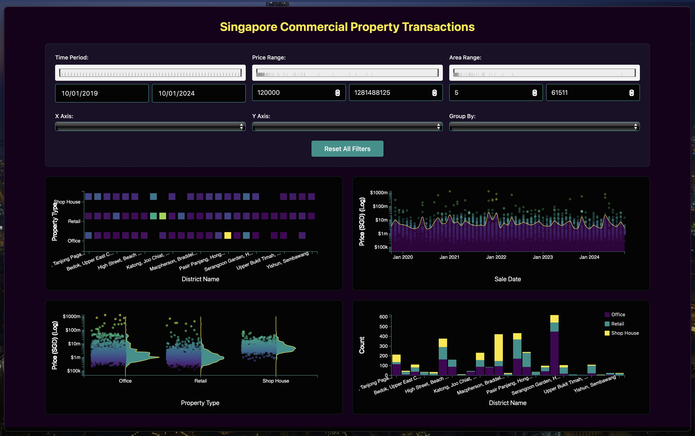

# Singapore Commercial Property Visualization Project 



## Running locally

1. Step 1: Have node.js and npm install
```sh
npm --version
```

2. Step 2: cd into the project file directory, basically where the `package.json` is located.
```sh
cd /path/to/your/project
```

3. Install dependencies with npm
```sh
npm install
```

4. Run the development server
```sh
npm run dev
```
